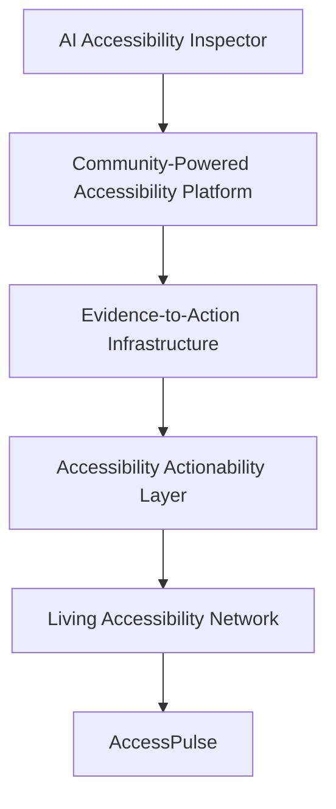
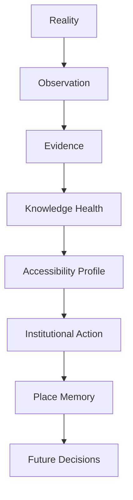
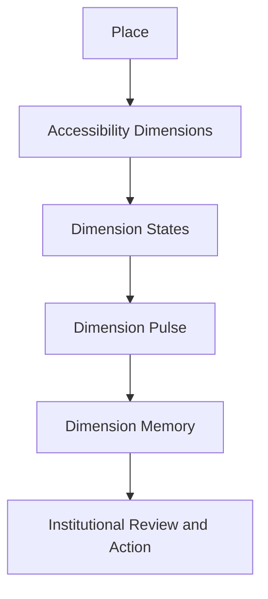
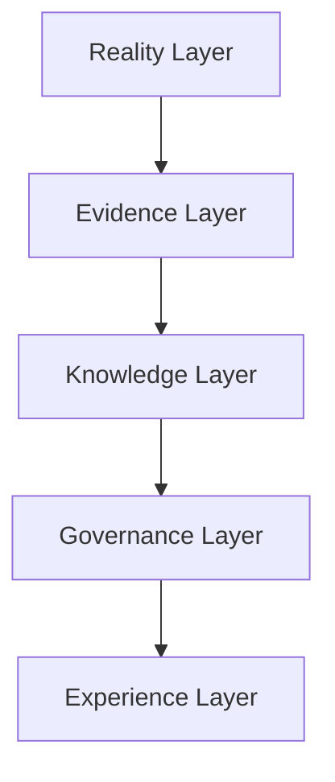
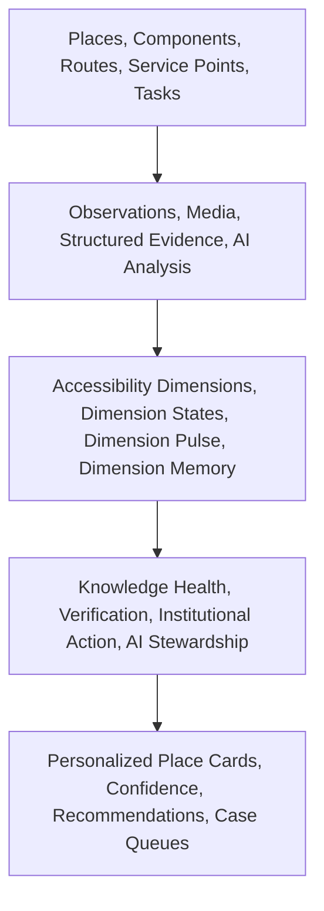
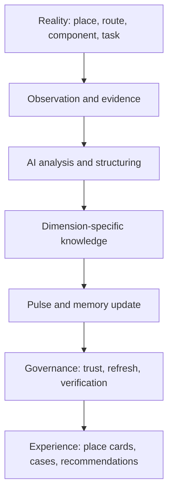
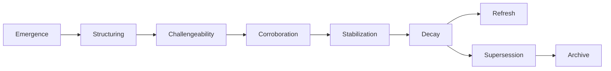
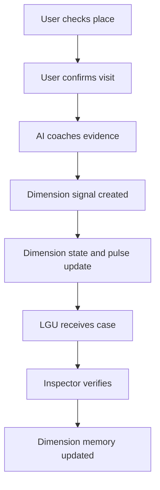

# AccessPulse Founder's Handbook — Final Consolidated SSOT

**Status:** Final conceptual foundation before implementation  
**Product:** AccessPulse  
**Platform:** Living Accessibility Network  
**Document Owner:** Founding Team  
**Purpose:** Single Source of Truth for product, engineering, AI, UX, data, and implementation decisions

---

## Table of Contents

- [1. Executive Summary](#1-executive-summary)
- [2. The Problem](#2-the-problem)
  - [2.1 Research Findings](#21-research-findings)
  - [2.2 Root Problem](#22-root-problem)
  - [2.3 Institutional Gap](#23-institutional-gap)
- [3. Product Discovery Journey](#3-product-discovery-journey)
- [4. Final Product Thesis](#4-final-product-thesis)
- [5. Mental Model](#5-mental-model)
- [6. Product Philosophy](#6-product-philosophy)
- [7. Stakeholders](#7-stakeholders)
- [8. System Overview](#8-system-overview)
- [9. Ontology and Place-State Model](#9-ontology-and-place-state-model)
  - [9.1 Reality Layer](#91-reality-layer)
  - [9.2 Evidence Layer](#92-evidence-layer)
  - [9.3 Knowledge Layer](#93-knowledge-layer)
  - [9.4 Governance Layer](#94-governance-layer)
  - [9.5 Experience Layer](#95-experience-layer)
- [10. Trust Model](#10-trust-model)
- [11. Knowledge Governance](#11-knowledge-governance)
- [12. AI Philosophy](#12-ai-philosophy)
- [13. AI Experience](#13-ai-experience)
- [14. User Experience](#14-user-experience)
- [15. MVP](#15-mvp)
- [16. Five-Minute Demo](#16-five-minute-demo)
- [17. Future Roadmap](#17-future-roadmap)
- [18. Design Principles](#18-design-principles)
- [19. Glossary](#19-glossary)

---

# 1. Executive Summary

AccessPulse is the first product in the **Living Accessibility Network**.

It exists to help people and institutions know whether places are truly accessible **right now**.

AccessPulse does not treat accessibility as a static compliance label. It treats accessibility as a **living public reality** that changes over time as the built environment changes, services change, and people experience places differently.

The central product belief is:

> **Every place has a living accessibility profile composed of multiple living accessibility states.**

Those states are updated through:
- community confirmations,
- AI-assisted evidence coaching and structuring,
- institutional verification,
- remediation,
- and ongoing knowledge governance.

AccessPulse is not:
- a complaint app,
- a static accessibility map,
- an inspector replacement,
- or a black-box AI compliance judge.

It is a **public accessibility knowledge system**.

Its job is to reduce the distance between:
- what communities actually experience, and
- what institutions can confidently act on.

## Why it exists

The Philippines already has accessibility laws, standards, and institutional responsibilities. The core gap is not the absence of policy. The gap is between:
- **institutional commitments**, and
- **real-world implementation**.

Accessibility is often documented as if it were fixed:
- a building was inspected,
- a ramp exists,
- a facility is labeled accessible,
- a record says compliant.

But real accessibility is dynamic:
- elevators break,
- paths get blocked,
- ramps become unsafe,
- service counters remain unreachable,
- signage is missing,
- a place may be usable for one person and inaccessible for another.

A static system becomes wrong silently. AccessPulse exists to keep public accessibility knowledge alive, challengeable, and trustworthy over time.

## Why AI is necessary

AI is necessary because ordinary people do not naturally produce institution-grade accessibility evidence, and institutions cannot manually interpret messy, partial, multimodal civic signals at scale.

In AccessPulse, AI is not a judge. It is an **Accessibility Copilot** and **Knowledge Steward**.

It helps users:
- collect stronger evidence,
- understand what is visible and what is missing,
- capture the right photo angles,
- express lived access barriers in structured ways,
- and improve the trustworthiness of reports before submission.

It also helps the system:
- detect stale knowledge,
- estimate uncertainty growth,
- identify contradictions,
- prioritize refresh opportunities,
- and protect the network from false certainty.

## Long-term vision

> **Accessibility should be governed as a living public reality, not a static compliance condition.**

AccessPulse is the first product layer that makes that vision tangible. Over time, it evolves into a national civic infrastructure layer where places are continuously understood through living accessibility knowledge rather than occasional paperwork, isolated complaints, or one-time audits.

## Hackathon MVP

The hackathon MVP proves one complete loop:

1. A user checks a place.
2. The user confirms or challenges the current accessibility state.
3. AI coaches stronger evidence and structures the signal.
4. The place’s accessibility state changes.
5. An institutional reviewer receives a trusted, action-ready case.
6. A human verifier confirms or disputes the issue.
7. The place’s memory and public state update.

> **Decision:** The MVP is intentionally narrow. It demonstrates the architecture, not full national coverage. The first build focuses on public service buildings and mobility-related entrance/ramp access.

## Key Takeaways

- AccessPulse governs living public accessibility knowledge.
- The system’s core object is not a complaint. It is a place’s multidimensional accessibility profile.
- AI strengthens evidence and stewards uncertainty. Humans retain judgment.
- The MVP demonstrates the full loop from lived experience to updated public truth.

---

# 2. The Problem

## 2.1 Research Findings

The research foundation is clear: accessibility law exists, but living accessibility truth is weak.

### Accessibility law and standards exist

The Philippines already has a legal and standards framework for accessibility, including BP 344 and its implementing rules. The policy intent is not ambiguous: the built environment should support access, reachability, usability, orientation, and safety.

### Institutional responsibilities exist

Multiple institutions already have accessibility responsibilities:
- **NCDA** for disability affairs coordination and advocacy,
- **DPWH** for built environment standards and infrastructure,
- **DOTr** for transportation-related accessibility,
- **LGUs / PDAOs** for local implementation and response,
- **building owners and operators** for maintaining actual facilities and services.

### The implementation gap is systemic

The research pattern showed that accessibility problems are not isolated anecdotes. They repeat across:
- buildings,
- transport,
- sidewalks,
- public services,
- information and service interactions.

The system remains largely:
- manual,
- reactive,
- complaint-driven,
- and resource-constrained.

### People experience accessibility as reliability, not paperwork

A person does not ask:
- “Was this place compliant at some point?”

They ask:
- “Can I get in?”
- “Will I need help?”
- “Will the elevator actually work?”
- “Can I find my way?”
- “Can I complete my purpose here?”

That is the key mismatch:
- institutions often manage accessibility as documentation,
- communities experience accessibility as present-day usability.

## 2.2 Root Problem

Accessibility itself is not the core problem.

The core problem is:

> **The absence of a trustworthy system that continuously converts lived accessibility reality into institutionally actionable public knowledge.**

### Symptoms

| Symptom | What it reveals |
|---|---|
| Ramps exist but are unusable | Static compliance does not guarantee lived access |
| Accessible labels become stale | Current reality drifts away from recorded truth |
| People discover barriers only on arrival | Public accessibility knowledge is weak |
| Institutions receive fragmented reports | Evidence is not action-ready |
| Inspection resources are stretched | Verification is expensive and episodic |
| Problems recur without institutional memory | No living memory of access history |

### Root causes

| Root Cause | Why it matters |
|---|---|
| Accessibility treated as static | Reality changes faster than records |
| Evidence quality is inconsistent | Institutions cannot trust or prioritize civic input |
| Complaint channels are fragmented | Signals do not become strong cases |
| No explicit freshness model | Old certainty continues to look true |
| No knowledge governance layer | The platform cannot tell when it no longer knows enough |
| One-dimensional representation of access | Different lived realities get flattened into one label |

### System bottlenecks

| Bottleneck | Description |
|---|---|
| Evidence bottleneck | People can describe barriers, but not always in institution-grade form |
| Trust bottleneck | Institutions need stronger, explainable signals |
| Freshness bottleneck | Silence is not evidence of stability |
| Knowledge bottleneck | Places lack living, dimension-specific memory |
| Governance bottleneck | The network must decide what deserves refresh, verification, or uncertainty |
| Ontology bottleneck | Accessibility is multidimensional, but static systems flatten it |

## 2.3 Institutional Gap

The institutional gap is the core theme AccessPulse addresses.

### What institutions promise
- legal accessibility obligations
- built environment standards
- public service inclusion
- local implementation and enforcement
- formal inspection and remediation pathways

### What communities experience
- uncertainty before traveling
- inaccessible routes despite official claims
- changing conditions that are not reflected in records
- difficulty translating lived harm into trusted evidence
- delay between barrier and action

The gap is:

> **What institutions believe exists vs. what people can actually use.**

AccessPulse exists to narrow that gap without pretending perfect certainty.

> **Decision:** AccessPulse is not an “awareness” tool. It is a truth-maintenance and actionability system.

## Key Takeaways

- The core issue is not the absence of law.
- The core issue is the absence of living, governable accessibility knowledge.
- Accessibility must be represented as current, uncertain, challengeable public truth.

---

# 3. Product Discovery Journey

AccessPulse was not designed in one step. The product became clearer through a sequence of conceptual pivots.



## Stage 1 — AI Accessibility Inspector
**Why we considered it**  
The earliest framing focused on using AI to detect accessibility problems in photos or environments.

**Why it was insufficient**  
This over-centered detection and under-centered institutions, evidence trust, and lived experience. It also risked implying AI could replace human judgment.

**Insight that drove the next shift**  
The real problem was not just detecting barriers. It was turning lived barriers into something institutions could act on.

---

## Stage 2 — Community-Powered Accessibility Platform
**Why we considered it**  
A community-driven model fit the idea that people closest to the problem should contribute to the solution.

**Why it was insufficient**  
A pure reporting platform put too much burden on PWDs and citizens, and risked becoming just another civic reporting app.

**Insight that drove the next shift**  
Reports alone are weak. What matters is whether a report becomes a trusted, action-ready case.

---

## Stage 3 — Evidence-to-Action Infrastructure
**Why we considered it**  
This reframed the product around the movement from lived experience to institutional action.

**Why it was insufficient**  
It clarified the pipeline, but still leaned too much on complaint logic and did not yet explain what the platform was really maintaining over time.

**Insight that drove the next shift**  
The system needed to maintain public truth, not just route evidence.

---

## Stage 4 — Accessibility Actionability Layer
**Why we considered it**  
This made the product’s role more precise: make lived accessibility evidence more actionable.

**Why it was insufficient**  
It solved the workflow layer, but not the larger worldview. It still focused on cases more than on places.

**Insight that drove the next shift**  
The product needed a stronger mental model than “better cases.” It needed to govern living place knowledge.

---

## Stage 5 — Living Accessibility Network
**Why we considered it**  
This introduced the long-term platform worldview: accessibility should be treated as a living public reality.

**Why it was insufficient on its own**  
The platform vision was strong, but a product still had to create the network.

**Insight that drove the next shift**  
The network should grow from repeated, useful interactions around places and their current accessibility state.

---

## Stage 6 — AccessPulse
AccessPulse became the first concrete product inside the Living Accessibility Network.

It centers on one repeatable user need:

> **Help me know whether this place is truly accessible right now, and help the system stay truthful over time.**

## Additional accepted design reviews that shaped the final architecture

### Living State Problem
The team discovered that a state can silently become wrong if nothing happens:
- a place marked reliable may degrade without a report,
- a degraded place may improve without a refresh.

This introduced:
- **Place Pulse**
- explicit freshness and decay logic
- the principle that silence is not stability

### Knowledge Governance
The team then recognized that representing knowledge was not enough. The system also needed to govern:
- who contributes,
- who verifies,
- who stewards,
- how truth is refreshed,
- how uncertainty is handled,
- and how civic attention is allocated.

### Unit of Accessibility Knowledge
The final major shift was recognizing that one place cannot be represented by one accessibility state. Accessibility is experienced differently across user needs and interactions.

This introduced:
- multidimensional accessibility,
- component/route/task-aware evidence,
- and the final ontology where places have **accessibility profiles**, not a single undifferentiated state.

## Key Takeaways

- Each pivot reduced simplification and increased truthfulness.
- The final system is not a complaint app, map, or inspector replacement.
- AccessPulse is the first product expression of a much deeper knowledge architecture.

---

# 4. Final Product Thesis

## Vision
**Accessibility should be governed as a living public reality, not a static compliance condition.**

## Mission
Reduce the distance between lived accessibility barriers and institutional action by maintaining trustworthy, current, and governable public accessibility knowledge.

## Core Belief
> **Every place has a living accessibility profile composed of multiple living accessibility states.**

## Core JTBD
When a person needs to use a place, help them and the institutions responsible for that place know the most trustworthy current accessibility reality available for the relevant dimension of access.

## Product Philosophy
AccessPulse does not store static accessibility labels.  
It maintains living accessibility knowledge.

## Platform Philosophy
The Living Accessibility Network emerges when repeated interactions with places create a continuously improving, multidimensional public memory of accessibility.

## Non-negotiables

- AI prepares evidence; humans make judgments.
- Unknown is better than outdated certainty.
- Truth expires.
- Every living accessibility state must have a pulse.
- Accessibility is multidimensional.
- The public experience must remain simple even if the underlying model is rich.
- The system must reveal where it does not know enough.
- No single actor owns accessibility truth.

> **Decision:** The handbook freezes the multidimensional model. Accessibility is no longer modeled as one place-level truth.

## Key Takeaways

- The product is no longer being discovered. The philosophy is final.
- Implementation must preserve living truth, multidimensionality, and human-AI collaboration.

---

# 5. Mental Model

The old mental model for civic accessibility is usually:

Complaint  
→ Report  
→ Institution  
→ Inspection  
→ Action

AccessPulse replaces that with a different model:



The key shift is this:

## Old model
Accessibility is something institutions occasionally inspect.

## New model
Accessibility is something the network continuously learns, refreshes, challenges, and governs.

### Official conceptual model



### Why this changes everything
- Complaints become one signal among many, not the system’s center.
- A place stops being a fixed record and becomes a living object.
- Knowledge quality becomes explicit.
- Institutions consume structured accessibility intelligence instead of scattered reports.
- Users receive current, dimension-relevant truth instead of generic labels.

## Key Takeaways

- AccessPulse governs living accessibility knowledge, not static compliance records.
- The new center of gravity is the place’s multidimensional accessibility profile.

---

# 6. Product Philosophy

## Accessibility should be governed as a living public reality
Accessibility is not static. It changes with:
- building condition,
- operations,
- maintenance,
- service design,
- and lived context.

Therefore it must be governed like a changing public condition, not a certificate.

## Every place has a living accessibility profile
A place is not “accessible” or “not accessible” in the abstract.

A place has:
- dimensions of access,
- current states within those dimensions,
- pulse showing the health of current knowledge,
- memory showing how those truths evolved.

## Users update accessibility states, not complaints
Users are not primarily filing complaints. They are:
- confirming current reality,
- challenging stale assumptions,
- refreshing public knowledge,
- and helping keep places truthful.

## Institutions consume accessibility intelligence, not fragmented reports
Institutions need:
- actionability,
- confidence,
- recency,
- evidence sufficiency,
- and traceable memory.

They do not need another pile of raw reports.

## Truth is living, layered, and challengeable
Public accessibility truth should always be:
- current enough,
- challengeable,
- explicit about uncertainty,
- and never presented as more certain than the evidence allows.

## Key Takeaways

- The philosophy is not about more data. It is about better-governed public truth.
- Every major system decision should reinforce the living-state worldview.

---

# 7. Stakeholders

## Stakeholder overview

| Stakeholder | Goals | Pain Points | Responsibilities | How AccessPulse Creates Value |
|---|---|---|---|---|
| Persons with Disabilities | Use places safely and independently | Uncertainty, broken promises, burden of reporting | Contribute lived experience and high-value confirmations | Trusted current place truth, less uncertainty, visible impact |
| Citizens / companions | Help or validate place access | Limited context, no structured channel | Confirm or challenge observed conditions | Lightweight participation in public truth |
| Senior citizens | Reduce strain and risk in using places | Paths, stairs, signage, service friction | Contribute mobility and usability observations | Better decision support and more accurate place states |
| LGUs / PDAOs | Triage, verify, and respond effectively | Noise, weak evidence, fragmented inputs | Local stewardship, review, verification, action coordination | Structured, prioritized accessibility intelligence |
| NCDA | Coordinate national disability knowledge and policy relevance | Fragmented local truth, weak visibility | National stewardship norms and oversight | System-wide patterns and governance view |
| DPWH / DOTr / sector agencies | Verify and act in domain-specific contexts | Legacy infrastructure, sparse signals | Sector verification and accountability | Better-targeted review and maintenance intelligence |
| Accessibility inspectors | Evaluate current condition and verify claims | Limited time, incomplete evidence | High-trust validation and adjudication | Stronger case packets and traceable place memory |
| Building owners / facility managers | Maintain place condition, reduce risk | Self-report credibility, delayed detection | Operational maintenance and remediation reporting | Early warning and structured update pathways |
| NGOs / advocates | Surface systemic accessibility reality | Anecdotal burden, uneven visibility | Trusted validation, watchdog stewardship, equity support | Structured evidence and pattern visibility |
| Businesses / institutions | Reduce accessibility failure and uncertainty | Fragmented feedback, no living truth | Maintain and respond to known issues | Clearer operational truth and accountability |
| Researchers / future partners | Study patterns and improve systems | Weak datasets, stale categories | Contribute validation, methods, and analysis | Richer, governed public accessibility knowledge |

## Key Takeaways

- Stakeholders do not share the same job, but they all benefit from stronger public accessibility truth.
- AccessPulse separates contribution, verification, stewardship, and accountability.

---

# 8. System Overview

AccessPulse is a layered civic knowledge system.

## Core architecture



## Full architecture



## Community Layer
Produces lived observations, confirmations, and experiential challenges to stale assumptions.

## AI Layer
- coaches stronger evidence,
- structures multimodal signals,
- assesses sufficiency and uncertainty,
- stewards knowledge health,
- prioritizes refresh opportunities.

## Evidence Layer
Stores:
- observations,
- photos,
- text,
- audio,
- structured accessibility evidence,
- and AI-produced analysis artifacts.

## Institution Layer
Receives:
- trusted signals,
- review-ready cases,
- verification prompts,
- and knowledge health insights.

## Accessibility State Layer
Maintains:
- dimension-specific current state,
- pulse,
- and memory for each place.

## Resolution Layer
Captures:
- verification,
- remediation,
- supersession,
- and changes to public truth.

## Implementation note
This architecture naturally maps to future:
- database entities,
- API services,
- AI pipelines,
- verification state machines,
- and frontend cards/views.

## Key Takeaways

- The system is layered by truth function, not UI.
- The central knowledge object is the place’s multidimensional accessibility profile.

---

# 9. Ontology and Place-State Model

This chapter defines the official ontology.

## Official ontology statement

> **The thing whose truth AccessPulse governs is the dimension-specific accessibility reality of a place over time.**

## 9.1 Reality Layer

The reality layer contains the physical and service environment as it exists before the platform interprets it.

### Official reality objects

| Object | Definition |
|---|---|
| **Place** | A real-world location or site users visit for a purpose |
| **Component** | A physical or service element within a place, such as an entrance, elevator, ramp, counter, restroom, signage cluster |
| **Route** | A path of movement connecting parts of a place, including arrival, path of travel, transition points, and destination access |
| **Service Point** | A point where service interaction occurs, such as a counter, help desk, kiosk, boarding point |
| **User Task** | The thing a person is trying to do at the place, such as enter, navigate, communicate, reach a counter, complete a transaction |

> **Decision:** The public-facing product speaks in place-level language, but the evidence and reasoning model must remain component-, route-, and task-aware to reflect professional accessibility practice.

## 9.2 Evidence Layer

The evidence layer records what people and systems observed about reality.

### Official evidence objects

| Object | Definition |
|---|---|
| **Observation** | A reported or captured account of what happened at a place, often tied to a user task |
| **Evidence** | A supporting artifact such as a photo, video, text note, audio note, structured response, or measured input |
| **Structured Evidence** | Evidence normalized into a machine- and institution-readable format |
| **AI Analysis** | AI-generated interpretation of evidence, including visible features, likely affected dimensions, missing evidence, and confidence |

### Key rule
Evidence does not equal truth. Evidence feeds knowledge.

## 9.3 Knowledge Layer

This is the core AccessPulse layer.

### Official knowledge objects

| Object | Definition |
|---|---|
| **Accessibility Dimension** | A category of access interaction through which a place can be meaningfully assessed |
| **Dimension State** | The current best public belief about a place within one accessibility dimension |
| **Dimension Pulse** | The health of current knowledge behind a dimension state, including freshness, support, volatility, and contradiction |
| **Dimension Memory** | The historical record of how a dimension state changed over time |

### Accessibility Dimensions

The official core dimensions are:

| Dimension | Meaning |
|---|---|
| **Mobility Access** | Entry, movement, circulation, and use where slopes, stairs, elevators, width, thresholds, and path continuity matter |
| **Visual Navigation Access** | Orientation, wayfinding, tactile cues, signage, and navigation usability for blind/low-vision contexts |
| **Communication Access** | Ability to receive, exchange, and understand service communication |
| **Cognitive / Comprehension Access** | Clarity, simplicity, and understandability of environment and service interactions |
| **Sensory / Environmental Access** | Environmental conditions that affect usable access, such as sound, light, and overload |
| **Service Completion Access** | Whether a person can successfully complete the purpose of visiting the place |

### Dimension State
A dimension state is not a legal conclusion. It is the current best public accessibility truth for that dimension.

Official state values:

- **Reliable**
- **Conditionally Usable**
- **Degraded**
- **Blocked**
- **Unknown**
- **Disputed**
- **Officially Verified**
- **Under Remediation**

> **Decision:** States describe current lived accessibility reality, not legal compliance status.

### Dimension Pulse
Pulse answers:

> How alive, supported, and current is our knowledge of this dimension right now?

Pulse is influenced by:
- recency of evidence,
- observation density,
- source diversity,
- verification recency,
- contradiction levels,
- volatility of the relevant components or routes.

### Dimension Memory
Memory stores:
- what changed,
- when,
- why,
- based on what evidence,
- and whether the change was community-confirmed, AI-structured, or officially verified.

Memory is never the same as current truth.  
Memory is the historical substrate that explains current truth.

## 9.4 Governance Layer

The governance layer decides how knowledge should be:
- trusted,
- challenged,
- refreshed,
- verified,
- and retired.

### Official governance objects

| Object | Definition |
|---|---|
| **Knowledge Health** | The overall health of current accessibility knowledge, both at the place level and network level |
| **Verification** | A higher-trust act that confirms, disputes, or reframes current knowledge |
| **Institutional Action** | Any formal response to verified or review-worthy accessibility knowledge |
| **AI Stewardship** | AI’s role in maintaining quality, surfacing uncertainty, and prioritizing refresh and review |

## 9.5 Experience Layer

The experience layer is the simplified public and institutional expression of deeper knowledge.

### Official experience objects

| Object | Definition |
|---|---|
| **Personalized Place Card** | The user-facing summary of the most relevant dimensions, confidence, freshness, and recommendation |
| **Accessibility Summary** | A simplified expression of multidimensional place truth for a given need or context |
| **Recommendation** | A user- or institution-facing suggestion about what to check, refresh, review, or expect |

## Information flow between layers



## Why this ontology matches professional practice

Accessibility professionals, auditors, and universal design practitioners rarely reason about the whole place as one undifferentiated truth. They reason across:
- routes,
- elements,
- services,
- user journeys,
- and interaction-specific access requirements.

AccessPulse preserves this professionally accurate structure internally while keeping the public-facing experience simple and useful.

## Key Takeaways

- The smallest meaningful public truth unit is **Place × Accessibility Dimension**.
- Evidence is finer-grained than the public state and may attach to components, routes, service points, and tasks.
- The public experience remains place-first, but the reasoning system is dimension- and task-aware.

---

# 10. Trust Model

Trust in AccessPulse is not a single score. It is a structured assessment of how much confidence the system should place in evidence, contributors, institutions, and current knowledge.

## Trust dimensions

| Trust Type | Meaning |
|---|---|
| **Evidence Trust** | How reliable and sufficient the submitted evidence is |
| **Source Trust** | How historically reliable a contributor or organization is |
| **Verification Trust** | How much weight a confirmation or dispute should carry |
| **Knowledge Trust** | How strong the current dimension state is given all inputs |
| **Temporal Trust** | How much currentness can still be inferred as time passes |

## Evidence confidence
Evidence confidence increases when:
- relevant components are visible,
- the route or service context is clear,
- media quality is good,
- evidence supports a specific dimension,
- user task context is known,
- and AI or reviewers can explain what is visible.

Evidence confidence decreases when:
- the image is partial,
- the route is not visible,
- the relevant feature is obscured,
- important dimensions cannot be assessed from current input,
- or contradictory evidence exists.

## Evidence sufficiency
Evidence is sufficient only relative to:
- a specific dimension,
- a specific claim,
- and the decision being supported.

Examples:
- one image may be enough to weaken mobility confidence,
- but not enough to officially verify route continuity,
- and irrelevant to communication access.

## How trust increases
- corroborating observations align
- trusted validators support the same conclusion
- official verification confirms lived experience
- recent evidence refreshes an aging dimension
- diverse source types support the same state
- contradictions are resolved

## How trust decreases
- knowledge ages without refresh
- contradictions persist
- owner self-reports are not independently confirmed
- a contributor repeatedly submits weak or misleading signals
- a place has high volatility but stale evidence
- an institution closes issues inaccurately or without validation

## Official trust rules

> **Decision:** Fresh evidence can weaken or strengthen a state, but it can never silently erase memory.  
> **Decision:** Unknown is a trustworthy outcome when confidence is insufficient.  
> **Decision:** Contradiction is represented, not hidden.

## Key Takeaways

- Trust is dimension-specific, time-sensitive, and challengeable.
- The system must distinguish confidence in evidence from confidence in current place truth.

---

# 11. Knowledge Governance

Knowledge governance answers a different question than product design:

> **Who is allowed to influence, strengthen, weaken, verify, steward, and retire public accessibility knowledge — and under what rules?**

## Governance functions

| Function | Meaning |
|---|---|
| **Contribution** | Add observations or evidence |
| **Maintenance** | Refresh aging knowledge |
| **Verification** | Confirm or dispute knowledge with higher trust |
| **Stewardship** | Protect knowledge quality, freshness, and equity |
| **Accountability** | Respond institutionally when knowledge implies responsibility |

## Governance model by actor

| Actor | Contribution | Maintenance | Verification | Stewardship | Accountability |
|---|---|---|---|---|---|
| Community members | Yes | Yes | Limited corroboration | Limited | No |
| PWDs / affected users | High-value experiential evidence | Yes | Functional validation | Limited | No |
| NGOs / advocates | Yes | Yes | Trusted third-party validation | Yes | Limited |
| Building owners / managers | Declared updates | Yes | Self-attestation only | Limited | Yes for operations |
| LGUs / PDAOs | Yes | Yes | Local official review | Yes | Yes |
| NCDA | Limited place-level | Limited | National oversight, not local truth ownership | Yes | Coordination |
| DPWH / DOTr / sector agencies | Domain-specific | Yes | Sector-specific formal verification | Yes | Yes in mandate |
| Inspectors | Yes | Yes | High-trust field verification | Limited | Yes via formal findings |
| AI | No original truth claims | Yes | No final authority | Yes | No |

## Knowledge lifecycle

Knowledge behaves like a living organism, not a flat record.



### Lifecycle meanings
- **Emergence:** a new signal enters
- **Structuring:** raw signal becomes interpretable
- **Challengeability:** the claim can be disputed
- **Corroboration:** aligned evidence strengthens it
- **Stabilization:** repeated support makes it reliable
- **Decay:** time or contradiction weakens it
- **Refresh:** new evidence updates current truth
- **Supersession:** better knowledge replaces older knowledge
- **Archive:** the older knowledge remains in memory but stops driving current truth

## Knowledge maintenance engine
AccessPulse cannot depend on random participation. It needs a deliberate maintenance logic.

The system should continuously decide:
- what needs refreshing,
- who should refresh it,
- when,
- and with what urgency.

### Maintenance signals
- weak pulse
- stale dimension state
- high public importance
- high volatility
- conflicting evidence
- recent search demand
- unresolved degraded public-service conditions
- underserved geography or dimension

## Attention Allocation Engine
Community and institutional attention are limited. The system should place the next observation where it creates the greatest public value.

### Priority factors
- place importance
- vulnerable population served
- historical volatility
- stale knowledge
- conflicting evidence
- search demand
- recurrence
- institutional response gap
- equity weight
- emergency relevance

## Knowledge equity
The network must not overfit to wealthy, urban, or highly active communities.

### Governance requirement
The system must detect and surface:
- coverage deserts
- under-observed dimensions
- stale municipalities
- one-source dependency
- invisible communities
- public-service places with weak pulse

### UI principle
“Unknown” should signal **insufficient public knowledge**, not **poor accessibility**.

## Truth under uncertainty
The system should confidently assert a dimension state only when:
- evidence is sufficient,
- the pulse supports currentness,
- contradiction is acceptable or represented,
- and confidence exceeds threshold.

Otherwise it must say:
> **We do not currently know enough.**

## AI as knowledge steward
AI’s governance role is to:
- detect stale certainty,
- estimate pulse decline,
- identify contradictions,
- prioritize refresh opportunities,
- and protect the network against false certainty.

AI never owns truth.

> **Decision:** AI is the custodian of uncertainty, not the sovereign of truth.

## Key Takeaways

- AccessPulse governs public accessibility knowledge, not just records.
- No actor owns truth alone.
- Governance preserves freshness, equity, challengeability, and accountability.

---

# 12. AI Philosophy

AI exists in AccessPulse for one reason:

> **To help ordinary people and institutions produce, maintain, and interpret accessibility knowledge that would otherwise remain too weak, partial, or costly to act upon.**

## Why AI exists
Without AI:
- evidence collection becomes weak and static,
- civic observations remain messy,
- institutional queues stay noisy,
- stale certainty is hard to detect at scale,
- and contradictory public truth is expensive to manage.

## Why AI should never replace inspectors
AI can:
- coach,
- structure,
- infer,
- prioritize,
- and explain.

AI cannot:
- issue final legal conclusions,
- override human field verification,
- silently rewrite truth,
- or replace adjudication.

## Why AI should preserve uncertainty
Accessibility evidence is often partial.
One image rarely answers every question.
A place may be reliable in one dimension and unknown in another.

If AI collapses uncertainty into confident labels, it corrupts the network.

## Why AI should coach instead of judge
The highest-value AI interaction is not “report summarized.”

It is:
- “Take a side photo of the ramp.”
- “This image helps assess mobility, but not communication access.”
- “I cannot see whether another entrance exists.”
- “This evidence is not yet strong enough for review.”

The AI helps people produce better evidence before the system acts on it.

## Why AI should produce institution-grade evidence
Institutions do not need more civic noise. They need:
- structured signals,
- clear reasoning,
- confidence,
- missing evidence markers,
- dimension relevance,
- and recommended next steps.

## Human-AI collaboration principle
Humans provide:
- lived experience,
- situational context,
- judgment,
- accountability,
- and official verification.

AI provides:
- evidence coaching,
- multimodal structuring,
- uncertainty handling,
- prioritization,
- and knowledge stewardship.

## Key Takeaways

- AI is essential, but bounded.
- AI strengthens truth formation; humans retain truth authority.

---

# 13. AI Experience

AccessPulse AI should feel like a **calm accessibility field inspector standing beside the user**.

Not a chatbot.  
Not a compliance judge.  
Not a generic assistant.

## AI personality
The AI is a blend of:
- copilot,
- accessibility expert,
- coach,
- investigator,
- and knowledge steward.

It should communicate like this:
- “I can see…”
- “It appears…”
- “I cannot determine…”
- “A wider photo would help…”
- “This is useful for mobility access, but not enough for communication access.”
- “Confidence increased because…”

## AI responsibilities in the user flow
- ask for better camera angles,
- identify what is visible,
- identify what is missing,
- explain why another observation matters,
- prevent overclaiming,
- structure evidence into dimension-relevant knowledge.

## Official AI reasoning pattern
Every AI assessment should answer:

1. **What did I observe?**
2. **Which dimension does this affect?**
3. **Why does it matter?**
4. **What evidence supports this?**
5. **What evidence is missing?**
6. **How confident am I?**
7. **What should happen next?**

## Example explanation template

```txt
Observed:
Steps are visible at the main entrance.

Dimension:
Mobility Access.

Why it matters:
If this is the only entrance, wheelchair users may not be able to enter independently.

Missing:
I cannot confirm whether another accessible entrance exists nearby.

Confidence:
Moderate.

Next step:
A wider photo of the full entrance area or institutional review would improve certainty.
```

## Computer vision role
Computer vision is used to reason about:
- entrances,
- ramps,
- stairs,
- doorways,
- routes,
- obstructions,
- signage,
- and other visible features.

But CV must always be dimension-aware:
- useful for mobility access,
- maybe partly useful for visual navigation,
- irrelevant or insufficient for some communication or service dimensions.

## Magical AI moments

1. AI refuses weak evidence and asks for a better angle.
2. AI tells the user exactly what photo would strengthen the case.
3. AI separates what it can assess from what it cannot.
4. AI detects that one report affects mobility access but says nothing reliable about communication access.
5. AI shows confidence improving as better evidence arrives.
6. AI turns a lived moment into an institution-ready evidence packet.
7. AI highlights that a place’s state changed because lived evidence challenged a stale assumption.
8. AI identifies that a previously verified state is aging and may no longer be current.
9. AI explains why a contradiction matters.
10. AI recommends where the next observation would create the most public value.

## Prompting philosophy
The AI should always optimize for:
- evidence quality,
- uncertainty honesty,
- relevance to a dimension,
- and usefulness to future human review.

## Key Takeaways

- AI is an accessibility copilot and knowledge steward.
- Its greatest value is making civic evidence stronger and truth more governable.

---

# 14. User Experience

The UX should make a new idea feel natural:

> **Places have living accessibility profiles.**

## Interaction philosophy
- Simple for people
- Rich underneath
- Truthful about uncertainty
- Calm rather than bureaucratic
- Helpful rather than accusatory

## Onboarding
Onboarding should teach the worldview in three beats:
1. accessibility changes,
2. places remember,
3. your visit can update public truth.

## Accessibility State Card
The state card is the public heartbeat of a place.

It should answer:
- What is the current state for my relevant dimension?
- How sure is the system?
- How recent is this?
- What changed?
- What should I expect?

### Example
**For you: Mobility Access**  
Degraded  
Last confirmed today  
Confidence: Moderate  
Reason: recent user confirmation suggests independent entrance access may not be reliable

## Place Memory
Place Memory is not an audit log.  
It is the public memory of how accessibility truth evolved.

It should show:
- key changes,
- which dimension changed,
- why,
- who or what strengthened the update,
- and whether it was later verified.

## Visual language
States should feel like changing environmental conditions, not grades.

### State language
- Reliable
- Conditionally Usable
- Degraded
- Blocked
- Unknown
- Disputed
- Officially Verified
- Under Remediation

### Color philosophy
- green for reliable,
- warm yellow for conditional,
- orange for degraded,
- red for blocked,
- neutral blue-gray for unknown,
- blue for under review / verification.

## Animations
The most important animation in the product is:

> **A user’s experience changes the visible state of a place.**

That is the magical moment:
- confirmation submitted,
- pulse updates,
- state changes,
- memory records the event.

## Demo story
The demo should make the audience feel:
- the old world relied on stale labels,
- the new world keeps places alive,
- AI helps people contribute stronger truth,
- institutions receive something they can actually use.

## Key Takeaways

- UX should make the ontology feel simple without flattening truth.
- Every interaction should reinforce that places remember and states evolve.

---

# 15. MVP

The hackathon MVP demonstrates the architecture, not the entire platform.

## Objective
Show that a place’s accessibility truth can be:
- checked,
- challenged,
- strengthened,
- updated,
- and institutionally reviewed in one loop.

## Scope
### Place type
Public service buildings

### Initial dimensions
- **Mobility Access** (primary)
- **Service Completion Access** (optional secondary if time permits)

### Initial user roles
- user / community participant
- LGU reviewer
- inspector / admin

## Core user flow



## MVP features
- place search
- place detail card
- dimension-specific state display
- quick visit confirmation
- barrier evidence submission
- AI evidence coaching and structuring
- case creation
- LGU review queue
- inspector verification
- state / pulse / memory update

## MoSCoW
### Must
- place detail
- one dimension state
- quick confirmation flow
- AI structured evidence
- LGU dashboard
- inspector verification
- timeline / memory

### Should
- confidence display
- pulse freshness indicator
- AI explanation panel
- role switcher for demo

### Could
- second dimension
- map view
- owner update stub

### Won’t
- nationwide coverage
- full legal rules engine
- full NGO workflows
- advanced sensor integrations

## Implementation readiness
This chapter should later map cleanly to:
- place, dimension, observation, evidence, case, verification entities,
- API services and Supabase-backed data access patterns,
- Gemini-powered AI analysis and evidence coaching pipelines,
- state update logic,
- Flutter screens, components, and state management.

## Reference implementation stack
The conceptual architecture is implementation-agnostic, but the project’s current implementation direction is frozen as:
- **Flutter** for the client application, prioritizing strong mobile accessibility support and native accessibility APIs,
- **Supabase** for Postgres database, storage, auth, and optional Edge Functions,
- **Gemini** as the AI provider for evidence coaching, multimodal analysis, and knowledge stewardship assistance.

These choices do not change the ontology or product philosophy. They are the current delivery stack for the MVP and near-term implementation.

## Key Takeaways

- The MVP is intentionally narrow.
- It proves the architecture with one or two dimensions and one full truth-update loop.

---

# 16. Five-Minute Demo

## Demo goal
Leave judges and future contributors with one belief:

> **Accessibility is not a static label. It is a living state that can change when people experience a place differently.**

## Demo structure

### 1. Opening — the old system is static
Show a place that appears accessible on record but has weak freshness and pulse.

Line:
“Today, accessibility records are often static. But public reality changes faster than paperwork.”

### 2. A person checks a place
Show the place card for mobility access:
- current state,
- confidence,
- pulse,
- last confirmation.

### 3. A lived experience challenges the state
The user confirms:
- entrance not independently usable,
- assistance required,
- optional photo or note.

### 4. AI strengthens the evidence
Show AI:
- identifying what is visible,
- asking for a better photo angle,
- structuring the signal,
- explaining confidence and missing evidence.

### 5. The place changes
Show the place’s mobility state changing from a stale or claimed condition to a newly degraded or disputed current state.

Line:
“The user did not file a complaint. They helped update the living accessibility state of the place.”

### 6. Institution sees action-ready intelligence
Show the LGU queue:
- place,
- affected dimension,
- evidence,
- confidence,
- urgency.

### 7. Inspector verifies
Show human verification updating the state and memory.

### 8. Close on the vision
Show the place memory timeline.

Closing line:
“AccessPulse is the first product in the Living Accessibility Network — a system where places remember, truth expires, and accessibility is governed as a living public reality.”

## Expected audience reaction
- This is not a reporting app.
- AI is genuinely useful here.
- The ontology is deeper than a map.
- The product can evolve into civic infrastructure.

## Key Takeaways

- The demo proves philosophy through interaction.
- The emotional center is the visible state change of a place.

---

# 17. Future Roadmap

The roadmap extends the same philosophy. It does not change it.

## Phase 1 — Prove the living state loop
- one place type
- one or two dimensions
- one institutional review flow
- visible state / pulse / memory update

## Phase 2 — Expand dimensions
Add:
- visual navigation access
- communication access
- cognitive/comprehension access

## Phase 3 — Expand evidence granularity
Improve component-, route-, service-point-, and task-aware evidence capture and reasoning.

## Phase 4 — Expand governance
Add:
- NGOs as trusted validators,
- owner/operator update workflows,
- partner accreditation,
- network health monitoring,
- equity dashboards.

## Phase 5 — Expand stewardship
AI evolves from evidence copilot into full knowledge steward:
- stale-state detection,
- refresh recommendation,
- contradiction prioritization,
- coverage blind-spot detection.

## Phase 6 — National network
The Living Accessibility Network becomes:
- place-aware,
- dimension-aware,
- equity-aware,
- institutionally actionable,
- and governable at municipal, sectoral, and national levels.

> **Future Work:** Explore domain-specific modules for transport, schools, hospitals, and emergency-critical civic places without changing the underlying ontology.

## Key Takeaways

- The MVP is a wedge.
- The network emerges by scaling the same truth model, not by changing products.

---

# 18. Design Principles

These principles are frozen unless a future architectural contradiction requires revision.

1. **Accessibility should be governed as a living public reality, not a static compliance condition.**
2. **Every place has a living accessibility profile.**
3. **A place’s truth is multidimensional.**
4. **Truth expires.**
5. **Unknown is better than outdated certainty.**
6. **Every living state needs a pulse.**
7. **Places remember.**
8. **Fresh evidence outweighs old assumptions.**
9. **Contribution is open; verification is structured.**
10. **No actor owns truth alone.**
11. **AI prepares evidence; humans make judgments.**
12. **AI stewards uncertainty; it does not rule on truth.**
13. **Silence is not stability.**
14. **The network must reveal its blind spots.**
15. **Every interaction should strengthen public accessibility knowledge.**
16. **Accessibility knowledge must be challengeable.**
17. **The public experience should be simple, but the underlying truth model should remain faithful to reality.**
18. **Institutional action should consume intelligence, not noise.**
19. **Place memory preserves history; place state expresses current belief.**
20. **Pulse describes how alive our knowledge still is.**

## Key Takeaways

- These principles are the product’s constitutional layer.
- Implementation decisions should be tested against them.

---

# 19. Glossary

| Term | Definition |
|---|---|
| **AccessPulse** | The first product within the Living Accessibility Network |
| **Living Accessibility Network** | The long-term civic infrastructure vision in which accessibility is governed as living public reality |
| **Place** | A real-world location or site users visit for a purpose |
| **Component** | A physical or service element within a place |
| **Route** | A path of movement connecting parts of a place |
| **Service Point** | A place within a site where service interaction occurs |
| **User Task** | The thing a person is trying to do at a place |
| **Accessibility Dimension** | A category of access interaction through which a place is assessed |
| **Accessibility Profile** | The full set of living dimension states for a place |
| **Dimension State** | The current best belief about a place within one accessibility dimension |
| **Dimension Pulse** | The health of current knowledge behind a dimension state |
| **Dimension Memory** | The historical record of how a dimension state changed over time |
| **Observation** | A user or system signal about what happened at a place |
| **Evidence** | Supporting artifact such as photo, video, text, or structured response |
| **Structured Evidence** | Evidence transformed into a machine- and institution-readable format |
| **AI Analysis** | AI-generated interpretation of evidence |
| **Knowledge Health** | The health of current public accessibility knowledge at place or network level |
| **Verification** | A higher-trust act that confirms or disputes current knowledge |
| **Institutional Action** | Formal response triggered by governed public knowledge |
| **AI Stewardship** | AI’s role in managing knowledge quality, uncertainty, contradictions, and refresh priorities |
| **Accessibility Copilot** | The user-facing AI behavior that helps collect stronger evidence |
| **State** | What the system currently believes |
| **Pulse** | How alive and trustworthy that belief still is |
| **Memory** | How that belief changed over time |
| **Reliable** | Current evidence strongly supports usability in the relevant dimension |
| **Conditionally Usable** | The place may be usable, but with assistance, caveats, or partial limitations |
| **Degraded** | Accessibility in a dimension is meaningfully weakened |
| **Blocked** | Accessibility in a dimension is currently not usable for the relevant interaction |
| **Unknown** | The system does not currently know enough to state a current truth confidently |
| **Disputed** | Significant contradictory evidence remains unresolved |
| **Officially Verified** | A higher-trust actor has formally verified the current state |
| **Under Remediation** | A verified issue is actively being addressed |
| **Evidence Sufficiency** | Whether the available evidence is enough to support a specific claim |
| **Actionability** | How ready a signal is for institutional review or response |
| **Knowledge Governance** | The rules and responsibilities that govern how public accessibility truth is created, maintained, challenged, verified, and retired |
| **Attention Allocation Engine** | The governance logic that determines where the next observation creates the most public value |

---

## Final Note

AccessPulse is no longer in product discovery.

This handbook is the conceptual foundation for implementation.

After this point, future work should primarily ask:

- How do we model this?
- How do we build this?
- How do we validate it?
- How do we scale it without breaking its truth model?

Not:

- What are we building?

Because that question is now answered.

> **AccessPulse is a system that governs living, multidimensional public accessibility knowledge so people and institutions can know whether places are truly accessible right now.**
